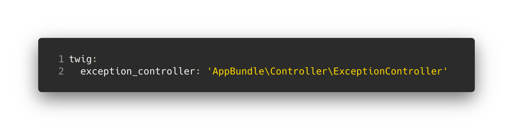

title: Error workflow - Logging
class: animation-fade
layout: true

<!-- This slide will serve as the base layout for all your slides -->
.bottom-bar[
  {{title}}
]

---

class: impact

# {{title}}
## In a Symfony application

---

 
 
<strong>Laurent VOULLEMIER</strong>
 
 
@Sensiolabs  
Team P50/MiddleOffice

---

---

# Meyclub

---
# Meyclub HttpRequestListener

  
* Responsible for creating error representation and logging errors
  
* If Logger call is forgetten, exception won't be logged
      
* $event->setResponse prevent next listeners to be executed
---
# Exception listeners on Meyclub

(bin/console debug:event-dispatcher kernel.exception)

Listener | Priority
--- | ---
AppBundle\EventListener\HttpRequestListener::onKernelException() | 0
Meyclub\Core\TechnicalBundle\Listener\ExceptionListener::onKernelException() | 0
Symfony\WebpackEncoreBundle\EventListener\ExceptionListener::onKernelException() | 0
ApiPlatform\Core\Bridge\Symfony\Validator\EventListener\ValidationExceptionListener::onKernelException() | 0
Meyclub\Api\ApiPlatformBundle\EventListener\ApiPlatformBundleExceptionSubscriber::onException() | 0
Meyclub\Api\ApiPlatformBundle\EventListener\ResourceNotFoundExceptionSubscriber::onResourceNotFoundException() | 0
Symfony\Component\HttpKernel\EventListener\ProfilerListener::onKernelException() | 0
Symfony\Bundle\SwiftmailerBundle\EventListener\EmailSenderListener::onException() | 0
Symfony\Component\HttpKernel\EventListener\RouterListener::onKernelException() | -64
ApiPlatform\Core\EventListener\ExceptionListener::onKernelException() | -96
Symfony\Component\HttpKernel\EventListener\ExceptionListener::onKernelException() | -128

---

# Possible solutions ?

---

 
 
 
 
 
 
# ... but there's still no logs ...

---

# Monolog configuration on Meyclub

---

# Monolog configuration in Symfony recipe

 

---

# Log efficiently

Don't do:

  
* Log doesn't bring extra information
* throwing a new exception leads to lose the original exception line

---

# Keep the original exception

  
* Don't catch at all, let the exception bubble  
 
* Or rethrow the original exception (original line is kept)  
 
* Or pass the original exception as previous:  
 
`throw new \RuntimeException('Error calling BPM', 0, $e);`
  
---

# Get more tracing

  
* Add debug/info logs along your code **before the exception is thrown**  
(you can use *finger-crossed* handler type in production to minimize the log files size)
     
* or/and add the exception trace:  
`include_stacktraces: true` in Monolog configuration

---

# Leverage context and psr-3 format

 

---

# Multiple channels can be used

  

OR

---

# Look at Monolog documentation

  
* **Handlers:** where and how logs are sent

* **Processors:** add extra information to logs

* **Formatters:** logs format

---

  
  
  
# Questions ?